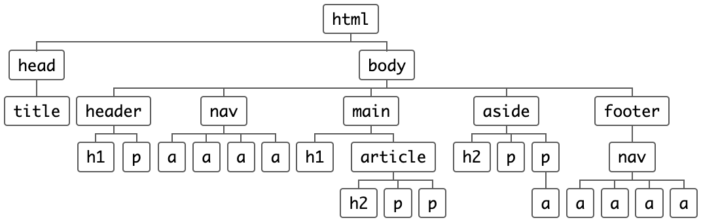

# Things im worried that I will never understand

https://trello.com/c/zPIVzgUg/477-confession-time-there-are-things-im-worried-that-i-will-never-understand

> There are technologies which I'm worried that I will never understand. Let's admit that and then go through a few of them.

## Description / Introduction

I would like to think that my technology preferences is based on objective reasons.

While trying to motivate some of my reasoning I noticed that my arguments were anything but objective. Instead I figured out that my reasoning is mostly fear/worry based, rather than objective. Let's talk about _that_, with a few different technologies as examples.

### Understandability matters

Guessing or Debugging.

- Sometimes I just type guesses and hope for the best.
- _Without any expected result._
- ... I _hate_ when that happens.

This is not what I call "debugging".

Debugging is the process of coming up with a hypothesist and verifying it.

Maybe debugging.

- Have you ever added logging you don't intend to keep, just to check whats going on?
- Have you ever set an ugly background color in a CSS selector, just to check which elements change?

Probably guessing.

- Have you ever commented out large blocks of code, just to check if a bug is there?
- Do you have `@Annotations` you might not need?
- Do you have CSS in your project which you are unsure if it's ever used?

Some things _are_ very difficult. 17 years of research on [Distributed Consensus](https://www.youtube.com/watch?v=B5NULPSiOGw&t=649s). (Use something else if you can.)

### Previous experience also matters

Mainly because you may already understand it.

## Where does this come from?

"How did _this_ end up here?"

- CSS
  - HTML - selector matching
- Spring
  - @Annotations
  - ["Externalized Configuration"](https://docs.spring.io/spring-boot/docs/current/reference/html/features.html#features.external-config)
  - ["Profiles"](https://docs.spring.io/spring-boot/docs/current/reference/html/features.html#features.profiles)
- Spring + Maven
  - Not all dependencies are downloaded before startup
- Class hierarchies

### Html + css example.



```css
p {
  background-color: pink;
}
main p {
  background-color: black;
}
article p {
  background-color: green;
}
article > p {
  background-color: yellow;
}
```

https://developer.mozilla.org/en-US/docs/Web/CSS/Specificity

### "Externalized configuration" example.

```java
@Component
public class MyBean {

    @Value("${name}")
    private String name;

    // ...

}
```

https://docs.spring.io/spring-boot/docs/current/reference/html/features.html#features.external-config

### "Profiles"

```java
@Configuration(proxyBeanMethods = false)
@Profile("production")
public class ProductionConfiguration {

    // ...

}

// spring.profiles.active=dev,hsqldb
```

https://docs.spring.io/spring-boot/docs/current/reference/html/features.html#features.profiles

### Unexpected dependency code.

```sh
cd ../docker-introduction/6_hello-world-http-java
code Dockerfile readme.md
cd -
```

No link, no explanation.

## Constant vigilance required

- Manual resource management
  - Memory
  - Sockets
  - Files
- `null`
- Languages in languages
  - json in yaml
  - html in js
  - go in python

## "Helpful frameworks"

- Vue (proxies)
- Svelt (compilers)
- React ("re-render everything")

## Counter examples

- SQL
  - Horrible syntax, but mostly understandable.
- ORMs (Object Relational Mappers)

## Mental overload?

"Denial Of Service attack on your understandability."

- npm
  ```sh
  tree ../nodejs-typescript-openapi/node_modules/
  code ../nodejs-typescript-openapi/package.json
  code ../nodejs-typescript-openapi/package-lock.json
  ```
- Maven
  ```sh
  tree ~/.m2/repository/
  code ../docker-introduction/6_hello-world-http-java/spring-petclinic/pom.xml
  mvn --file ../docker-introduction/6_hello-world-http-java/spring-petclinic/pom.xml help:effective-pom
  mvn --file ../docker-introduction/6_hello-world-http-java/spring-petclinic/pom.xml dependency:tree
  ```
